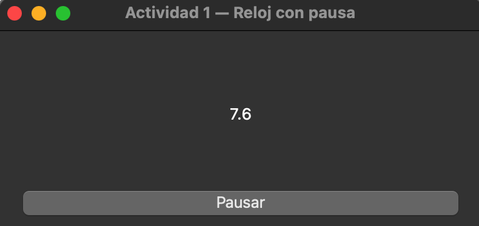

# Actividad 1 — PyQt5 + Señales + QThread: “Reloj con pausa”

## Enunciado
Crea una aplicación PyQt5 con:
- Un `QLabel` que muestra un contador en segundos.
- Un botón “Pausar / Reanudar”.
- Un `QThread` que incrementa el contador cada segundo.
- El thread emite una señal `actualizar_tiempo(int)` para actualizar la interfaz.
- El hilo no puede modificar la interfaz directamente.
- La interfaz no debe congelarse.

## Interfaz

