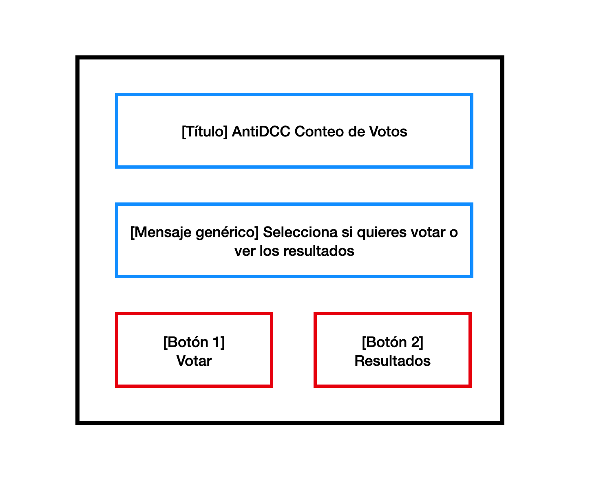
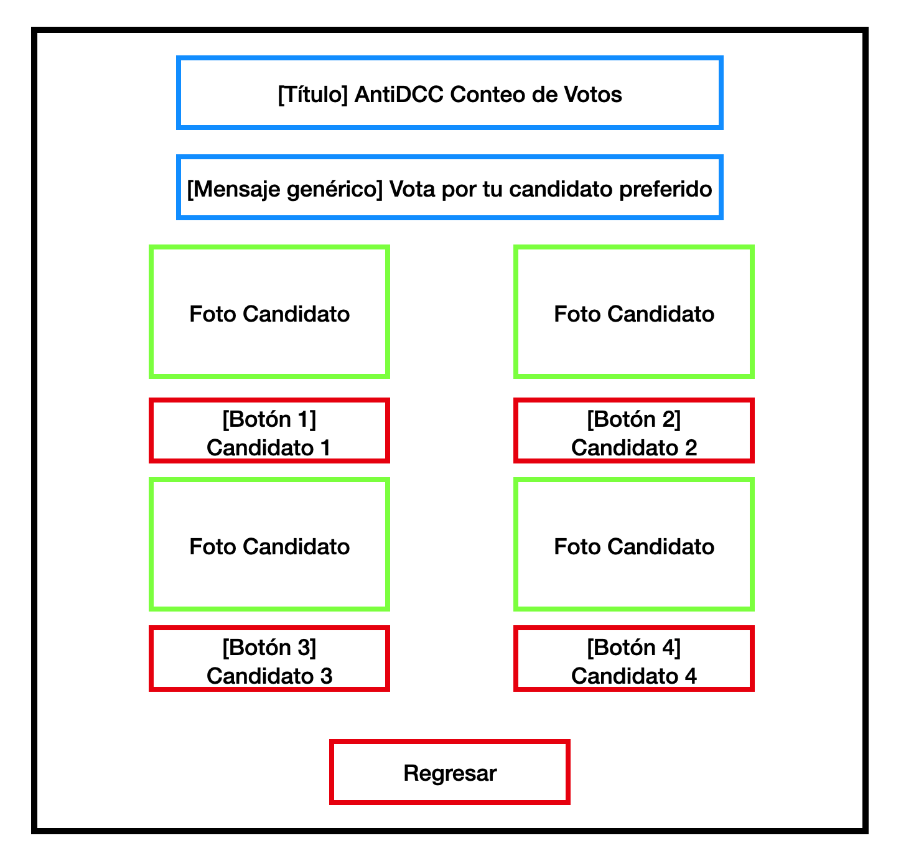
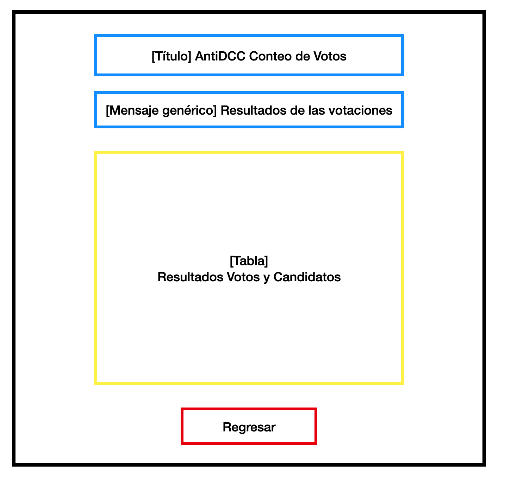

# Votaciones Pangüin't : )

En este ejercicio tendrán que programar interfaces gráficas que manejen el sistema de votaciones. Además, tendrán que 
implementar la lógica del backend y recibiran datos de otros puestos de votaciones por medio de una API (don't get worried **yet**).
El objetivo es usar `PyQt5` para las interfaces gráficas y `threading` para los votos simultáneos.

Hay 4 candidatos:

```python
CANDIDATOS = ["Flip Flop", "Los 3 Mishqueteros", "IIC2233.pop()", "y Perry?"]
```


## Ejecución

La aplicación si se trata de una GUI se puede correr desde el archivo editado, o sino, siempre desde `main.py`

## Frontend

Existirán 3 ventanas, la primera, es una ventana de bienvenida que tendrá dos botones. Uno para votar, y uno para ver el
conteo de votos en vivo. Tras darle click al botón, la ventana de bienvenida se debe cerrar. Además, debe haber un botón
de volver atrás en las otras dos ventanas para regresar a la ventana de bienvenida.

### Bienvenida

> `frontend/welcome.py`

Un esquema opcional de la ventana es el de la imagen de abajo.



**Tareas:**
- TODO: Agrega el texto genérico de manera centrada
- TODO: Agrega los botones para votar y ver resultados.
- TODO: implementen una funcion para centrar la ventana

### Votar

> `frontend/client.py`

Un esquema opcional de la ventana es el de la imagen de abajo.



Las imágenes de los candidatos están en la ruta `frontend/resources/__.png`
Ten en cuenta que sólo puedes votar una vez.

**Tareas:**
- TODO: implementen una función para centrar la ventana
- TODO: crea una señal llamada sig_votos que emita el nombre del candidato seleccionado
- TODO: Recuerda añadir la lógica para que un usuario no pueda votar más de una vez
- TODO: Coloca un título a la ventana
- TODO: Completa la función agregando QLabels, QButtons y Layouts
- TODO: Botón volver
- TODO: usen la función usada en welcome.py
- TODO: Crea una funcion que permita regresar a la ventana de bienvenida
- TODO: Recuerda añadir la lógica para que un usuario no pueda votar más de una vez
    - Tip: pueden usar esta función cuando se haga click en el botón. Pero, recuerden que solo se pueden pasar funciones, no argumentos. Hint( `lambda` )
- TODO: Emite la señal sig_votos con el nombre del candidato seleccionado

### Resultados

> `frontend/results.py`

Un esquema opcional de la ventana es el de la imagen de abajo.



**Tareas:**
- TODO: Crea el layout segun el enunciado
- TODO: Instancia una tabla de VotesTable y guardala en self.votes_table
- TODO: Ubica correctamente self.last_update_label y self.votes_table
- TODO: Crea e implementa el botón volver
- TODO: usen la función usada en welcome.py
- TODO: este es uno de los slots que es conectado. Implementalo actualizando self.votes_table haciendo uso de su método update_votes que recibe un dict, además, cuando lo actualices, actualiza también self.last_update_label con la hora actual. Usa: time: str = strftime('%H:%M:%S')

## `QtWidgets` a Usar

### `QPushButton`
Un botón que puede ser clickeado para ejecutar una acción.

> Hint: puedes usar `clicked.connect(<función>)` para conectar el botón a una función, en especial
> puedes usar `clicked.connect(lambda: <función>(<argumento>))` para pasar argumentos.

### `QLabel`
Un widget que muestra texto o una imagen haciendo uso de `QPixmap`.

```python
object = QLabel(self)
object.setPixmap(QPixmap(<ruta>.jpg/png))
```

### `QVBoxLayout` y `QHBoxLayout`
Layouts que organizan widgets en una columna o fila respectivamente.

### `QTableWidget`

Un widget que muestra datos en una tabla.

### `QPixmap`

Para añadir una imagen a un `QLabel` puedes usar `QPixmap`.

```python
object = QLabel(self)
object.setPixmap(QPixmap(<ruta>))
```

Para el apartado de la ruta usa la función entregada en `client.py` llamada `tlp(<ruta desde client.py>)`, por ejemplo:

```python
self.tlp("resources/01.png")
```


## Backend

En _Backend_ tienes que asegurarte de que se actualicen los resultados en tiempor real.
Además, hay múltiples puestos de votaciones, por lo que alguien con mucho tiempo libre creó una API
que recolecta estos votos. Para saber estos votos, te los dará la función: `get_external_votes()` que retornará
un diccionario con los votos externos, así:

```python
from backend.utils import get_external_votes
return_from_api: dict = get_external_votes()
print(return_from_api) # {'votes': {'Flip Flop': 3, 'Los 3 Mishqueteros': 2, 'IIC2233.pop()': 10, 'y Perry?': 5}}
```

Debes llamar a esta función cada 5 segundos. Puedes usar `threading` y `QTimer()` para esto.

### `VoteManager`

> `backend/vote_manager.py`

Esta clase cuenta con múltiples funciones que mezclan y suman los votos, por lo que no hay que preocuparse. Sin embargo, 
hay tareas relacionadas con threading y señales.

**Tareas:**
- TODO: Implementa el Lock para evitar race conditions


### `ExternalVotesWorker`

> `backend/external_worker.py`

Esta clase es un `QThread` que se encargará de llamar a la API cada 5 segundos y emitir una señal con los votos externos.

**Tareas:**
- TODO: Crea un QTimer e implementalo con start(), conecta su timeout a fetch() 
  - Tip: así como hacías clicked.connect(<función>) con los botones, puedes hacer timeout.connect(<función>)
- TODO: Todo QTimer necesita un start() para comenzar a funcionar
- TODO: emite un dict de los votos externos usando get_external_votes()
- TODO: Inicia el QTimer de worker (`main.py`)

